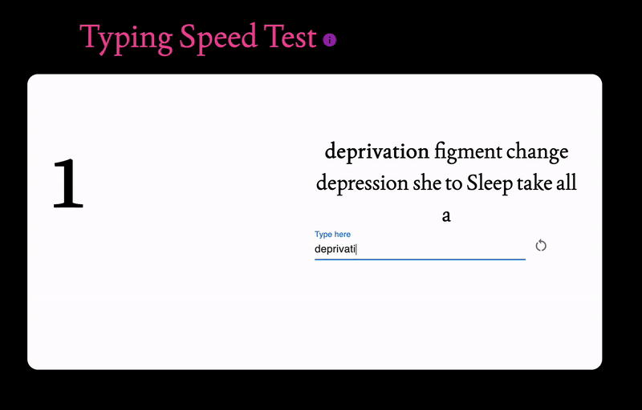

# Typing Speed Measure

Typing Speed Measure is a web application that allows users to measure and track their typing speed. It provides an engaging interface to practice typing while delivering accurate words-per-minute (WPM) calculations.



## 🚀 Deployed Application

Check out the live application here:  
[Typing Speed Measure](https://peaceful-muffin-0fc3d6.netlify.app/)

## 🛠️ Technologies Used

- **Frontend**: TypeScript with React
- **Styling**: Tailwind CSS
- **Deployment**: Netlify

## 📄 Features

- Tracks and displays your real-time typing speed (WPM).
- Clean and responsive design for both desktop and mobile.
- Smooth typing experience with instant feedback.

## 🔧 How to Run Locally

1. Clone the repository:

   ```bash
   git clone git@github.com:albert-dinh-01/TypingTest.git
   ```

2. Navigate to the project directory:

   ```bash
   cd TypingTest
   ```

3. Install dependencies:

   ```bash
    npm install
   ```

4. Start the development server:

   ```bash
   npm start
   ```

## 📜 License

This project is licensed under the [MIT License](LICENSE).  
You are free to use, modify, and distribute this project as long as proper credit is given to the original author.
